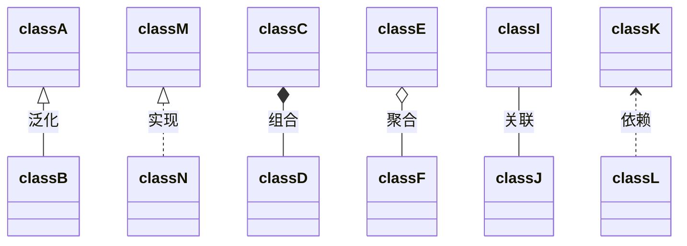
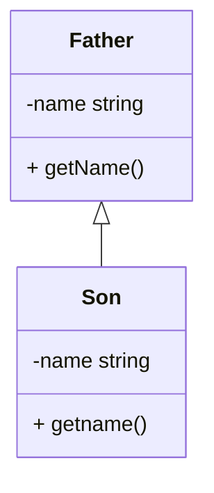
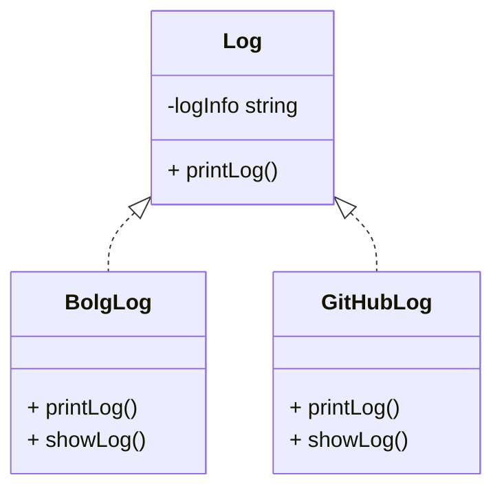
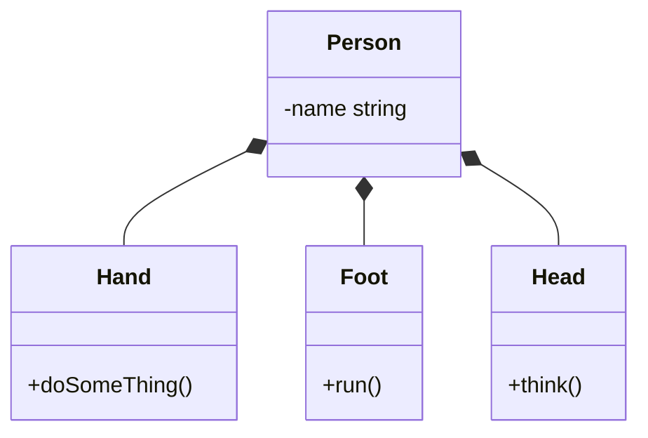
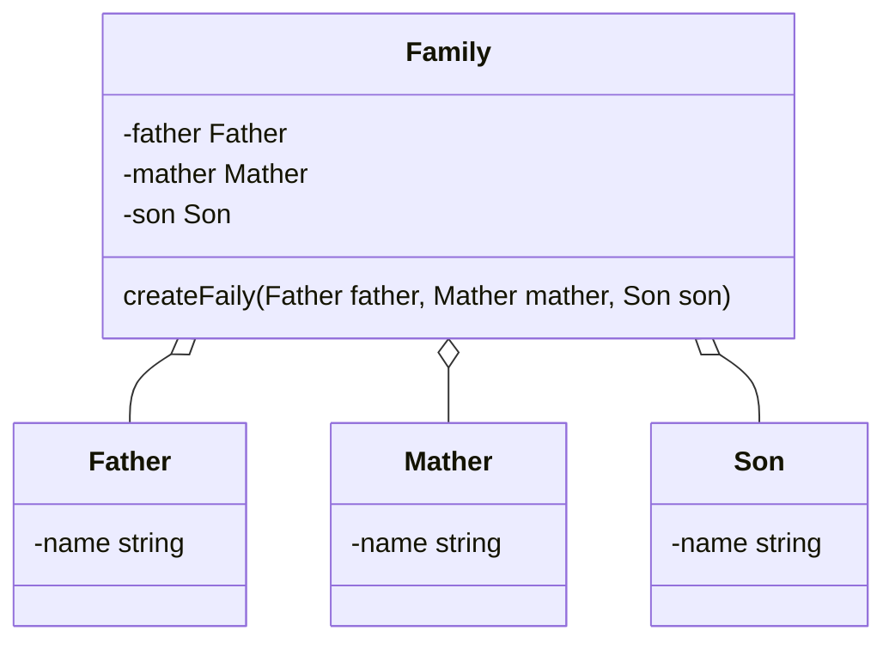
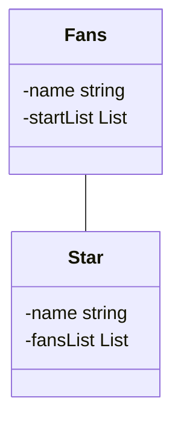
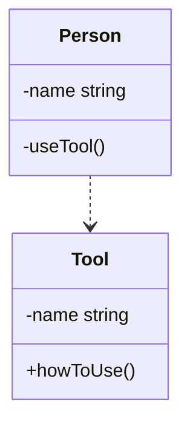

# create UML by mermaid

Markdown is a good language for write something! If you want to noteing some diagram, you can used mermaid to do diagram.

## I want to do class diagram by mermaid

UML is a good language for class diagram!

## Do you know what relationship between class?

*  Dependence
*  Generalization
*  Association
*  Aggregation
*  Composition
*  Implementation

### 泛化（Generalization）

###  实现关系（Realization）

### 组合关系

* 成员离不开组织

### 聚合关系（Aggregation）

* 成员可以单独存在
* 整体与部分的关系

### 关联关系（Composition）

* 对象之间的相互引用关系

### 依赖（Dependency）

