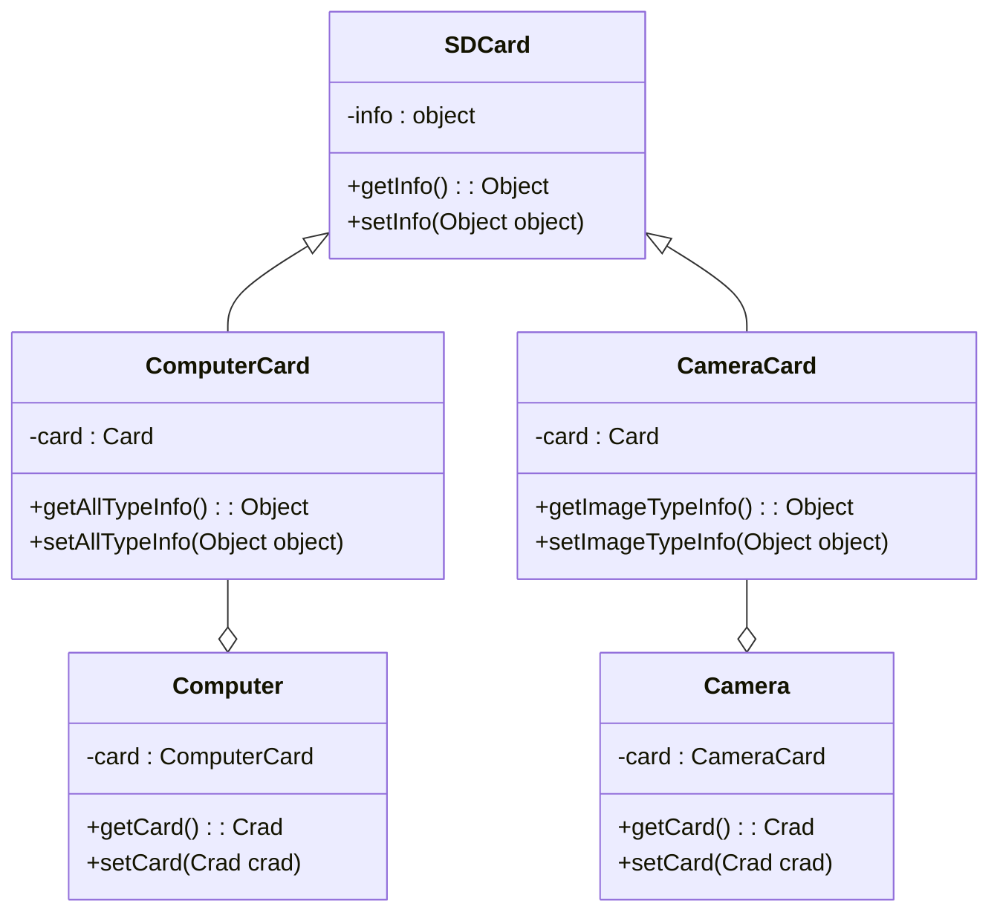

**# 适配器模式**

>  什么是适配器？



## 描述

* 有一张SD卡
* 一台电脑
* 一台照相机
* 电脑无法直接读取SD卡的信息
* 照相机也无法读取SD卡的信息
* 然后为SD卡创建一个适配器
* **SD卡的电脑适配器**
* SD卡内部的信息不变
* 但是提供了电脑可以读取信息的借口
* **SD卡的照相机适配器**
* SD卡内部的信息不变
* 但是提供了照相机可以读取信息的借口


## 本次实例

有关于日志

> 在电脑的运行过程中会产生日志！但是读取日志的信息是我们需要的一项技能，只要我们稍微的思考，我们就知道，对于相同的日志信息，不同的人关注的要点是不一样的，是不是可以用适配器模式来设计一个不同的人读取相同日志的工具呢？

## 需求分析


有一个日志文件
里面的信息格式如下

```bash
运行日志 >>> 2021-7-7 23:37:23|->正在运行
打印日志 >>> 2021-7-7 23:37:23|->正在打印1
打印日志 >>> 2021-7-7 23:37:23|->正在打印2
打印日志 >>> 2021-7-7 23:37:23|->正在打印3
测试日志 >>> 2021-7-7 23:37:23|->正在打印4
测试日志 >>> 2021-7-7 23:37:23|->正在打印5
测试日志 >>> 2021-7-7 23:37:23|->正在打印6
```
假设有俩种对象：开发与测试

* 开发只看运行日志
* 测试只看测试日志

很简单，让我们开始吧！
